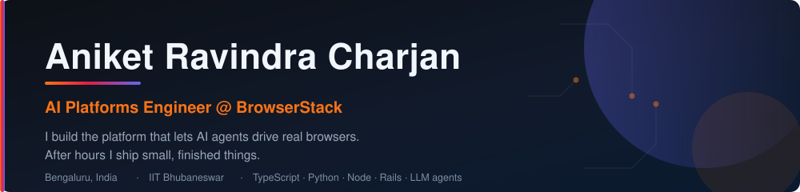
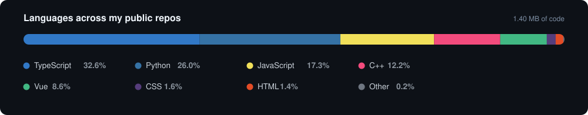

  

  
  
  
  

---

## 🚀 Things I've built

<table>
<tr>
<td width="50%" valign="top">

### 🎮 [Road Clash](https://github.com/jason-bourne-gg/road-clash)
Pseudo-3D Road Rash-style combat racer — hand-written renderer, physics and audio, **no game engine**. Solo campaign plus **P2P multiplayer with live voice**.

`TypeScript` `Canvas` `WebRTC` `Vite`

**[▶ Play it](https://road-clash.vercel.app)**

</td>
<td width="50%" valign="top">

### 🧬 [Genesis](https://github.com/jason-bourne-gg/genesis-highlevel-app-builder)
AI app builder for the HighLevel CRM. Describe an app in plain English; Claude writes the files while you watch, and it runs on your real contacts and calendars.

`Vue 3` `TypeScript` `Firebase` `Claude API`

**[▶ Live](https://genesysbe-cbd7e.web.app)** · **[Demo](https://www.loom.com/share/7af776bf596c4a14824270543d8a56dd)**

</td>
</tr>
<tr>
<td width="50%" valign="top">

### 📡 [DirectDrop](https://github.com/jason-bourne-gg/DirectDrop)
Send a file straight to another browser. No upload, no server, no account — the bytes go peer-to-peer and never touch a backend.

`TypeScript` `WebRTC` `Trystero`

**[▶ Try it](https://direct-drop-sigma.vercel.app)**

</td>
<td width="50%" valign="top">

### 🤖 [my-mcp-server](https://github.com/jason-bourne-gg/my-mcp-server)
My résumé as an MCP server — Tools, Resources **and** Prompts. Point Claude or Cursor at it and interview me over stdio.

`MCP` `TypeScript` `Anthropic SDK`

</td>
</tr>
<tr>
<td width="50%" valign="top">

### ✂️ [Agent Web Clipper](https://github.com/jason-bourne-gg/web-clipper-extension)
One-click Chrome extension turning any page into clean, LLM-ready Markdown or JSON. Pure readability heuristics — **no AI in the loop**.

`Manifest V3` `JavaScript`

</td>
<td width="50%" valign="top">

### 📚 [Doc Parser RAG Bot](https://github.com/jason-bourne-gg/DOC-PARSER-RAG-BOT)
RAG over your own documents: pgvector similarity search, chunk re-ranking, and answers generated by Claude.

`Node` `PostgreSQL` `LangChain` `Claude`

</td>
</tr>
</table>

---

## 💼 What I do all day

At **BrowserStack** I work on Low Code Automation — the platform where an AI agent authors, runs and repairs browser tests without anyone writing code. Mostly **agentic test authoring**, **self-healing replay**, and the **accuracy/cost telemetry** that keeps a fleet of LLM-driven runs honest.

Distributed systems, Node and Rails services, an Electron desktop app, Kafka pipelines — and a lot of time spent asking *"why did the agent do that?"*

> 💡 Work commits land under **[@aniket-charjan](https://github.com/aniket-charjan)**. This account is where the side projects live.

---

## 🧭 Where I've worked

| | Role | When |
| --- | --- | --- |
| **[BrowserStack](https://github.com/browserstack)** | SWE — AI Products | Feb 2025 — present |
| **[Sigmoid Analytics](https://github.com/sigmoidanalytics)** | SDE-1 — Backend | Jan 2024 — Jan 2025 |
| **[Sigmoid Analytics](https://github.com/sigmoidanalytics)** | ASDE — Backend | Jul 2022 — Dec 2023 |
| **IIT Bhubaneswar** | Integrated Masters, CGPA 8.60 | 2017 — 2022 |

Before BrowserStack I built backend platforms at **Sigmoid Analytics** for some of the
world's largest CPG companies — a budgeting and auditing platform spanning 22 countries,
and the performance-marketing system behind [Advertising-Tool-Backend](https://github.com/jason-bourne-gg/Advertising-Tool-Backend).

---

## 📊 By the numbers

  

  

---

## ⚙️ Tech I reach for

**Languages**  

**AI &amp; Agents**  

&nbsp;· RAG · embeddings · agent evals &amp; cost telemetry

**Backend**  

**Frontend**  

**Data &amp; Infra**  

---

  <i>e-sports &gt; sports &nbsp;·&nbsp; Carlos Rodríguez &gt; Elon Musk &nbsp;·&nbsp; <a href="https://twitter.com/G2esports">@G2esports</a> ❤️</i>

